# FPGA_ThreeLevelStorage
```
目标设备：FPGA（本项目采用的是Xilinx Nexy4）
工程软件：Vivado 2018
编程语言：Verilog HDL
本项目包括：
	1. DDR2 读写模块封装，方便移植
	2. SD卡 读写控制模块
	3. 数据和指令Cache
	4. 五级流水线MIPS CPU（非主角）
```

[toc]

## 1. 项目背景

### 1.1. 答谢

感谢我的坚实好友`林mx（Tongji CS 2016）`提供了本项目的`SD卡读写模块`，感谢`Tongji CS 2015`的`陈z`、`黄yx`、`刘tc`等大佬的答疑解惑，感谢`香哥`的`真香警告`给了我完成的动力。

### 1.2. 实验描述

本实验是同济大学计算机系《计算机系统结构》专业课的课程设计。

 目前，大多数计算机都采用的Cache（高速缓冲存储器）、主存储器和‘’磁盘存储器（辅存）构成的三级存储系统，这个存储系统可以看成是“Cache-主存”和“主存-辅存”层次组成的系统。


 这一设计是为了解决存储容量和速度的矛盾，大大提升计算机系统的性能。其具有如此神奇作用的原因则是程序的局部性原理——包括空间的局部性和时间的局部性。

 “Cache-主存”和“主存-辅存”这两个层次的对比如下面的表格：

|                           | **“Cache-主存”层次** | **“主存-辅存”层次** |
| :-----------------------: | :------------------: | :-----------------: |
|         **目的**          |  弥补主存速度的不足  | 弥补主存容量的不足  |
|    **存储管理的实现**     |    全部由硬件实现    |   主要由软件实现    |
|     **访问速度比值**      |        几比一        |      几万比一       |
|      **典型块大小**       |    几十~几百字节     |      几千字节       |
| **CPU对第二级的访问方式** |      可直接访问      |    均通过第一级     |
|  **不命中CPU时是否切换**  |        不切换        |   切换到其他进程    |

 在本次提升实验之中，也遵循这样的设计原则。即“Cache-主存”这一层次对程序员来说是完全透明的，程序员直接给地址访问主存，Cache则默默无闻地工作，完全由硬件实现。

### 1.3. 总体框架

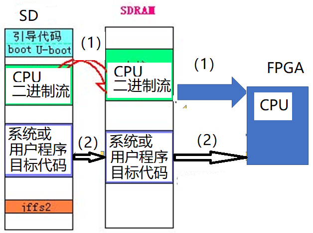

 这是三级存储系统的总框图，是一个较为抽象的概念图，具体实现则需要结合硬件实验环境选取合适的部件。

### 1.4. 实验环境

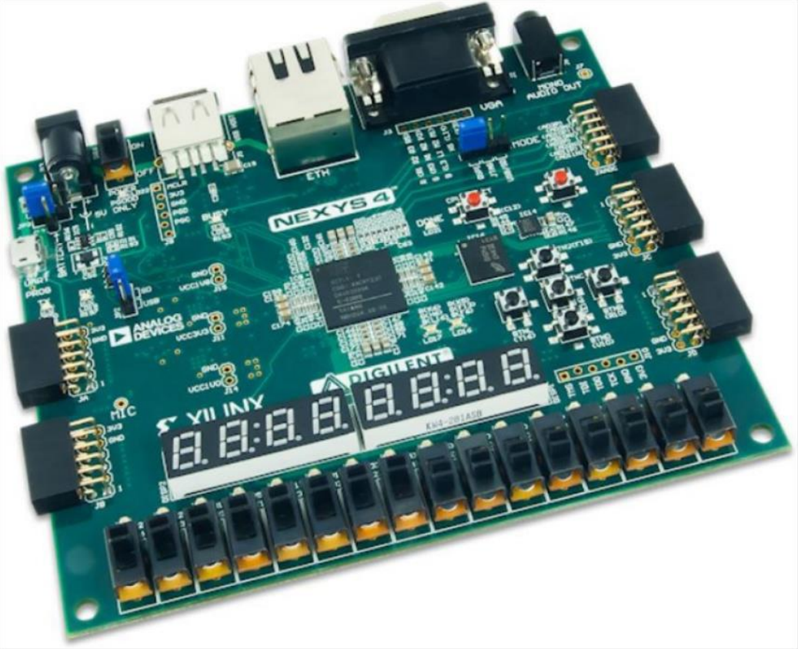

 **硬件环境：**

 我们本次提升实验的硬件环境为Digilent Nexys4 DDR Artix-7 FPGA Board开发板。这一开发板上带有一块容量为128M DDR2 SDRAM，可以作为我们的主存SDRAM。还有SD的卡槽，可以把SD Flash作为我们的第三级存储（辅存）。 

 使用Distributed Memory作为Cache。

 板上的100 MHz的时钟接入此系统，并通过分频器给每个部件合适的频率。

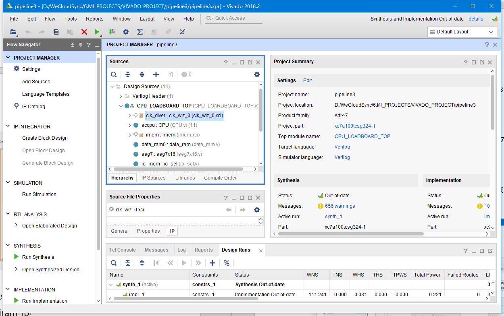

 **软件环境：**

 软件环境为windows10操作系统下的Vivado 2018.2。

### 1.5. 实验具体要求

 SD卡中存放流水线CPU的二进制流，以及用户程序，N4板上电自动完成如下的任务：

1. 1.  采用跳线的方式，FPGA自动从SD卡中获取流水线CPU的二进制流,并运行该二进制流，使FPGA成为CPU。
   2.  CPU再按照三级存储的方式访问SDRAM，再由SDRAM从SD卡中把用户程序的目标代码调入到SDRAM，再由CPU把SDRAM中的用户程序目标代码调入到片内CACHE加以运行。

## 2. SOPC系统整体设计

### 2.1. 系统设计总体模块图

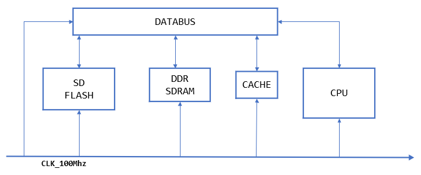

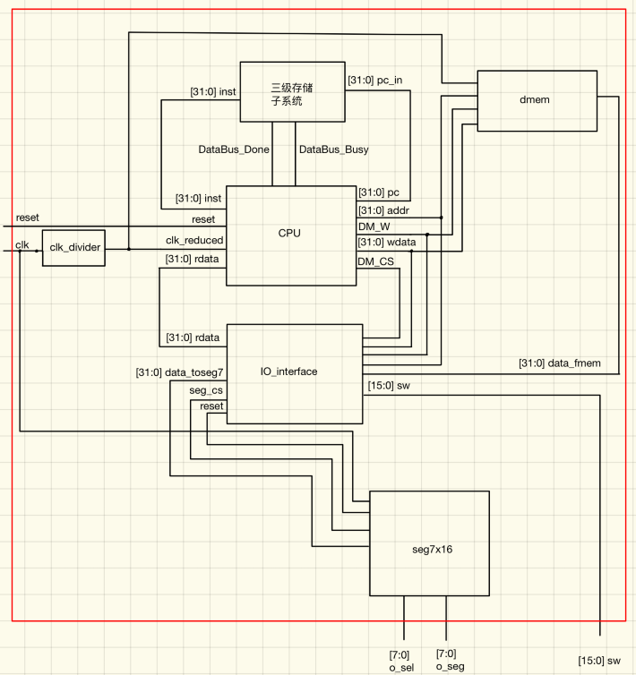

### 2.2. 三级存储子系统设计

**(1) 地址的设计**


 我将主存地址地址划分为这三个部分。

 Cache中的一个块大小为128个字（一个地址对应一个字），所以块内位移的地址位数应该是7位。

 Cache中一共有四个块，所以索引位为2位。

 其余的高位则作为标识位。 Cache工作的基本原理如图所示。

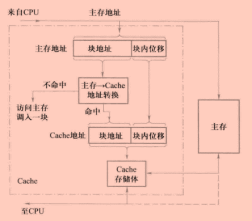

(2) Cache映射与替换

 在本次提升实验中，我选取了直接映像的方式。主存的块大小和Cache块设为一样，都是128个字的大小。映射的规则可以用下面的示意图形象的表示出来。

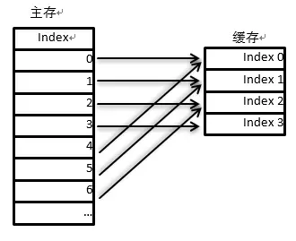

 主存中的每一个块只能被放置到Cache中唯一的一个位置，从主存块到Cache块的对应关系是依次循环分配的。

 如果主存块的索引为i，它映射到Cache块的索引为j，设Cache的块数为M，则有下面的对应关系：$$j=i mod M$$

 这样我们可以很方便地通过主存块地址的低2位去选择直接映像Cache中的块。为了实现判断是否命中，我在DataBus中设置了一个标识寄存器。

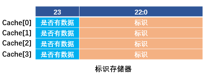

 CPU做访存操作的流程大致如下。

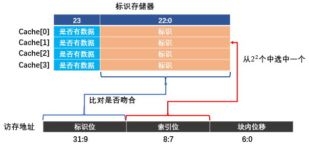

 如果发现标识寄存器中对应的单元，其最高位为0或者最高位虽然为1但是标识与访存地址的标识不符，则要启动替换（加载过程），将主存SDRAM中的数据块调入Cache中，同时修改标识寄存器，继续刚才的访存操作就会命中取得数据。

### 2.3. 系统工作数据流说明

 三级存储子系统与CPU协调工作。CPU会告诉存储子系统访问的地址，存储子系统会通知CPU工作状态（是否忙）和取出的数据。CPU的工作是高速的，存储子系统是低速的、时常停顿的。因此我在数据总线模 块DataBus与CPU的连接上给CPU一个busy、done的信号，当DataBus忙的时候，busy信号有效，CPU的流水线必须通过stall控制器实现暂停等待，当done信号有效的时候说明读写数据完成，CPU可以继续运行。

 开发板在上电后，会自动从外存中加载比特流(SOPC.bit)文件下板，使FPGA变成CPU。然后系统会自动地从SD卡的0地址处读出MIPS指令放入SD缓存中，然后DataBus会启动booting过程，将SD缓存中的指令数据搬到DDR SDRAM（主存）。

 CPU初始状态会读取0地址，因为一开始Cache中是没有数据的，故标识存储器也是无效状态，读不命中。这时DataBus将会控制SDRAM和Cache，将SDRAM中对应的数据块调入直接映像的CPU中并修改标识存储器，然后发送done信号并将读出的数据送给CPU。程序得以启动。

 在运行的过程中，如果发现Cache中数据块有数据但不是对应标识的，也会启动调块过程，将Cache块中的数据替换掉。

 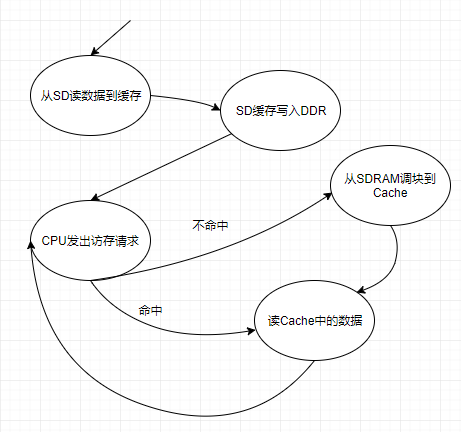

## 3. 具体模块实现方法

### 3.1. DDR模块

 DDR是Nexys4板上的Nexys4板子上的一个资源，容量为128M。DDR的操作非常复杂，需要借助一个IP核Memory Interface Generator，简称MIG（当然用了MIG还是非常复杂，需要多级封装）。

 MIG能够封装DDR的物理层信号，用户不需要对物理信号有所了解，只需要关注应用信号。MIG需要按照资料中指导的操作生成。但是由于DDR相较于cpu属于慢速的设备，所以要协调工作的话还要靠下面的MIG控制器。IP核生成后，需要将DDR的物理接口添加到顶层模块，但无需再在XDC文件中配置端口，因为生成过程中已经配置好了。

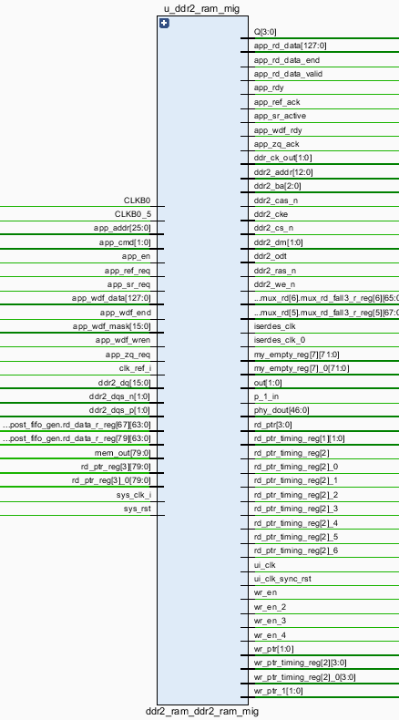

 其中，需要连接到最顶层的物理接口如下：

```verilog
inout [15:0]			ddr2_dq,
inout [1:0]             ddr2_dqs_n,
inout [1:0]             ddr2_dqs_p,
output [12:0]           ddr2_addr,
output [2:0]            ddr2_ba,
output                  ddr2_ras_n,
output                  ddr2_cas_n,
output                  ddr2_we_n,
output [0:0]            ddr2_ck_p,
output [0:0]            ddr2_ck_n,
output [0:0]            ddr2_cke,
output [0:0]            ddr2_cs_n,
output [1:0]            ddr2_dm,
output [0:0]            ddr2_odt
```
 应用接口及其含义为：

```verilog
app_addr[26:0]：访问的地址
app_cmd[2:0]:命令类型，000为写入，001为读取
app_en:高位有效信号，表明地址地址和命令已经有效，发出握手信号
app_rdy:高电平代表接口已经准备好接收命令了。若app_en发出后该信号无效，上述信号应重新发送
app_rd_data[63:0]：读出的数据
app_rd_data_valid:高电平代表读出的数据有效
app_wdf_data[63:0]:要写入的数据
app_wdf_end:代表当前的数据是本次写入数据的结尾
app_wdf_mask[7:0]:掩码，用于指定输入数据的哪些位会被写入到DDR中。若都是0的话，则所有位都会被写入。
app_wdf_rdy:高电平代表接口处于准备状态，可以写入数据
app_wdf_wren:高电平有效，写入允许信号。只有当app_wdf_wren和app_wdf_rdy均有效的时候，数据才会被写入到DDR中。
```

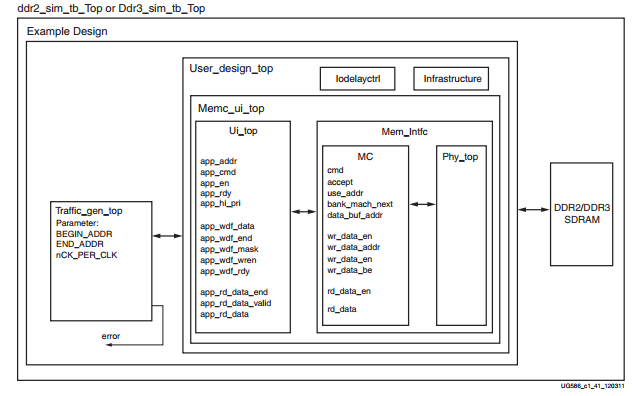

 MIG需要再次封装，根据官方手册中读写时序的要求，给出相应的控制信号。

 **写操作的时序：**

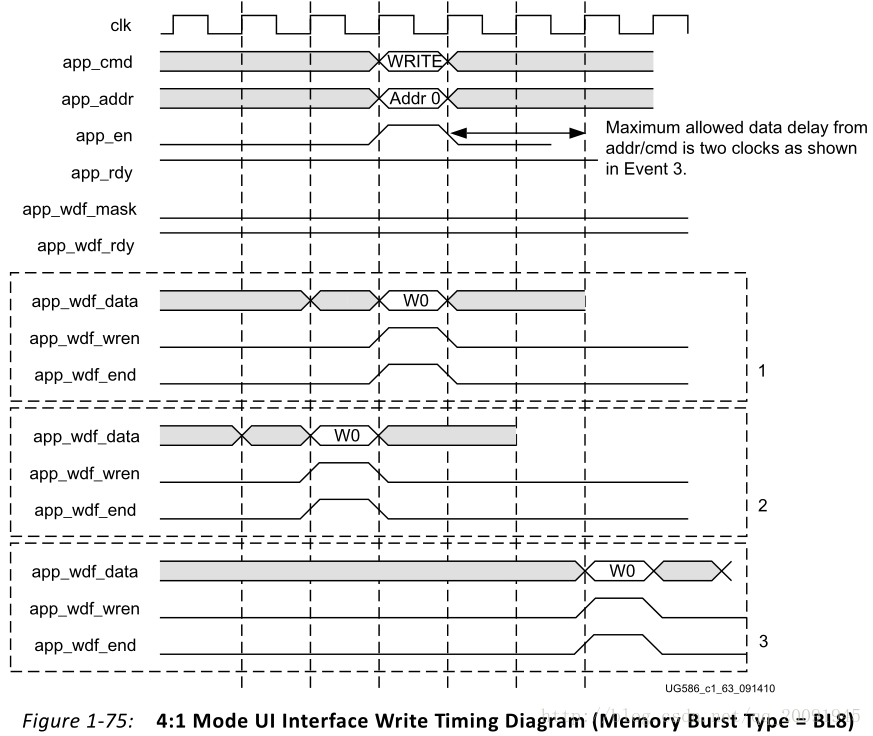

 **读操作的时序：**

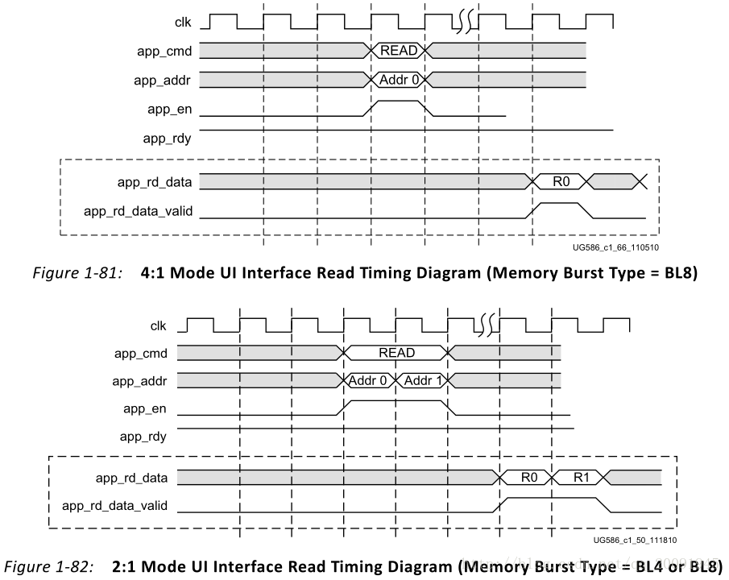

 **非工作状态：**

 令app_en无效，app_wdf_wren和app_wdf_end等信号也无效。该步不应省略，否则可能会出现实际要工作时无法写入等情况。

 在实际的实验过程中，出现了很多的问题，MIG的同步性并不好，为了更好地工作，我将MIG改成了同步工作的部件。当给DDR发出一个读/写请求后，DDR控制器会陷入工作状态，置busy为1done为0，维持给MIG的读写请求的一段时间确保读写一定完成，再置busy为0 done为1。这样封装好的DDR部件，我将其命名为sealedDDR.v

 经过无数次的实验和仿真，确定了设反复读写次数为256是一定无误的。所以我封装后的DDR的工作周期为100Mhz/256.

封装好的DDR模块可以连接到数据总线DataBus上去，sealedDDr的模块图如下所示：

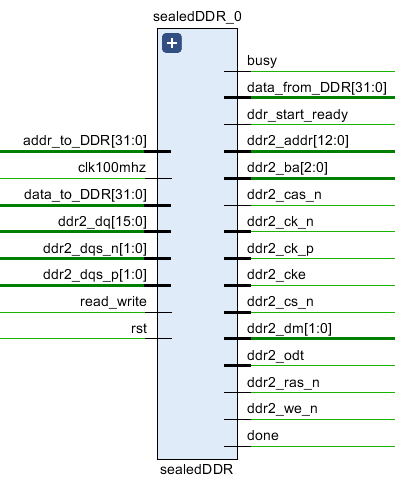

### 3.2. Cache模块

 Cache块是通过一个Distributed Memory实现的。容量为512个字，和前面对Cache的设计保持一致，4个块每个块128个字，4×128=512。

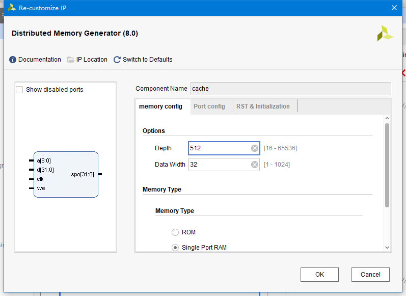

 Cache是可读可写的，所以这里设置Memory Type为Single Port RAM。

### 3.3. SD模块

 SD卡为移动设备提供了安全的，大容量存储解决方法。它本身可以通过两种总线模式进行数据传输，一种是称为SD BUS的4位串行数据模式，另一种就是本次实验采用的4线SPI Bus模式。

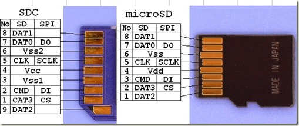

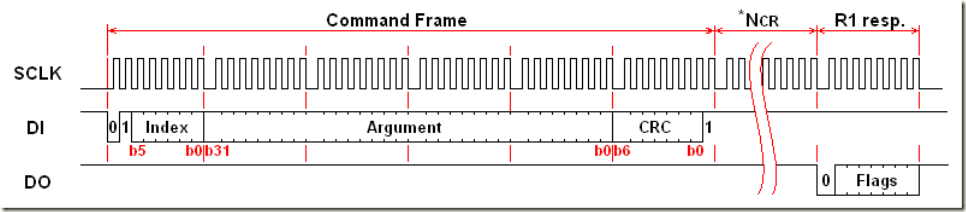

-  **初始化操作**

 SPI模式下的初始化操作有：上电->进入SPI模式（CMD0）->检测当前MCU电压是否符合SD卡的要求（CMD8)->开始初始化(ACMD41)->读取卡类型(CMD58)。

 **上电**

 当电压达到SD卡的最小工作电压的后，必须使CS，DI为高电平，输出最少74个时钟脉冲后，才能开始发送第一个命令。

 **初始化**

 SD卡上电后处于SD Bus模式，使CS保持为0，并且发送CMD0命令，SD卡就会进入到SPI模式。 初始化完成后，通过发送CMD58指令读取卡的类型（OCR寄存器的CCS位[30]), CCS为1表示当前卡的类型为SDXC或者SDHC，为0表示卡的类型为SDSC。

-  **数据读写操作**

 **读取单个数据块**

 发出读取单个数据块命令CMD17，若SD卡返回响应无错误（返回0），则开始等待数据块起始标识符0xFE, 然后开始读取数据块和CRC校验。

 **读取多个数据块**

 读取多个数据块操作和读取单个数据块的相似，先发送命令CMD18，然后开始等待数据块的起始标识符。需要停止读取操作时，发送CMD12命令，返回响应为0表示SD卡处于忙碌状态，只有返回任何不为0的值后，才能发送下一条命令。

-  **SD卡封装**

 SD模块给出工作状态信号sd_mem_ready，只有有效后才能进入BOOTING状态。

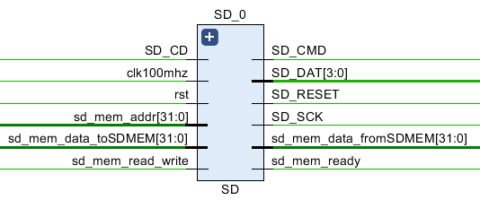

 SD卡的数据，每当系统初始或者reset的时候，就会重新读入SD缓存中，为搬入DDR做准备。

### 3.4. 数据总线DataBus模块

 数据总线DataBus模块可以说是整个三级存储的核心部件。虽然叫DataBus，起到构建数据通路，连接存储部件的作用。但是实际上它是三级存储的核心控制器，既负责和CPU配合同步，又负责给出所有存储模块（辅存SD FLASH、主存DDR SDRAM、高速缓存Cache）的读写信号并控制数据流向。

 DataBus的模块图如下：


 它的连线连接了CPU、SD、DDR和Cache.

 DataBus是一个有限状态自动机，总共有4个工作状态：

|     名称      |                             含义                             |
| :-----------: | :----------------------------------------------------------: |
| UNINITIALIZED | 未初始化，是系统刚上电或者复位后的状态。由于DDR和SD模块都有一个初始化的过程，所以本状态需要接收DDR和SD的Ready信号后才进入BOOTING状态。 |
|    BOOTING    | 系统正在初始化中，这一个状态是SD中的数据向主存DDR写入的过程。通过两个计数器，用二重循环将DDR中的数据块一个一个写上数据。BOOTING结束后转入READIMEM状态。 |
|   READIMEM    | 读Cache状态：在这里比对地址和标识存储器，判断是否命中，如果Cache命中，Cache中的数据送出DataBus；否则转入DDRTOIMEM状态。 |
|   DDRTOIMEM   | Cache发生未命中后，DDR中的数据块往Cache中调的过程。掉块结束后将转入READIMEM状态。 |

### 3.5. 五级流水线CPU

 五级流水线CPU是平时实验完成的内容，这里不再多介绍。


 此处对CPU稍做的改造是，向CPU传入DataBus的工作状态，并把工作状态信号传入CPU的暂停控制模块中，将给CPU一个新的暂停的理由，以达到三级存储子系统和CPU协调工作的目的。当DataBus忙的时候，stall信号全1，将CPU所有部件暂停；等待done信号到来继续工作。

## 4. 运行与验证

### 4.1. 从U盘下板

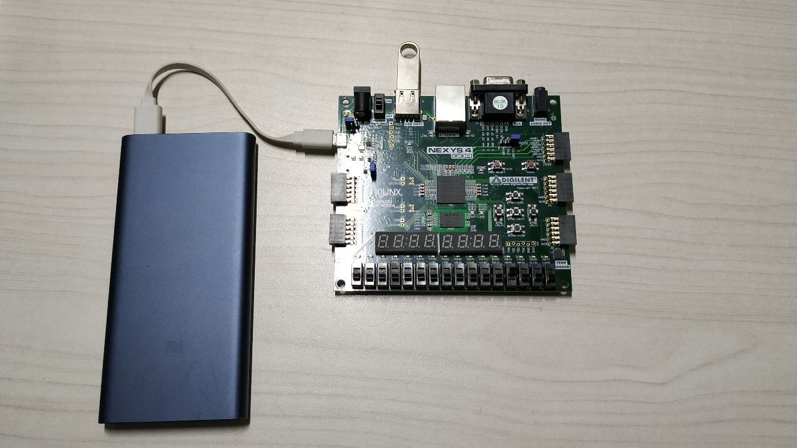

 使用移动电源供电。比特流在u盘中，应用程序在SD卡中。

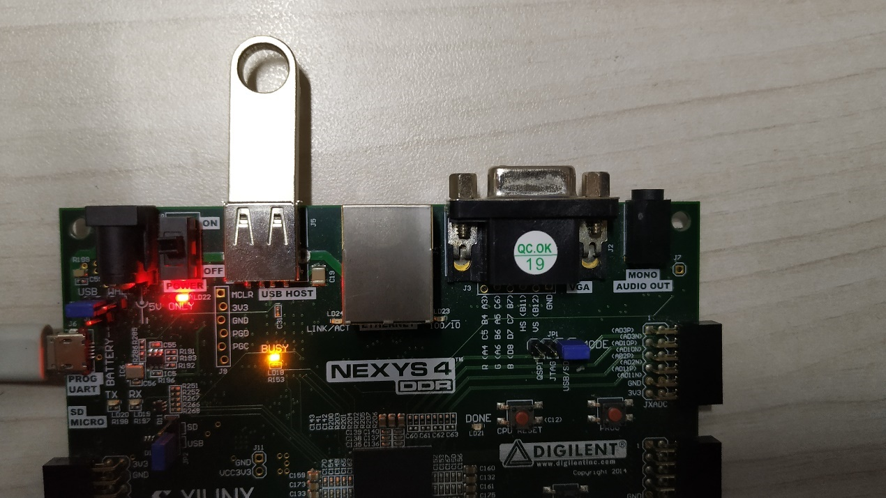

 黄色的BUSY灯常亮，说明正在下板。

 为了便于了解系统的工作状况，我将LED[2:0]这三个接了特殊的信号。LED[0]用于显示系统是否就绪；

 LED[1]亮时表示从存储子系统读到了数据；

 LED[2]表示存储子系统正忙，可能是正在启动，也可能时因为发生Cache块的装入、替换。除了最开始启动，其他时间一般忙的时间非常短暂，LED[2]只会闪一下。

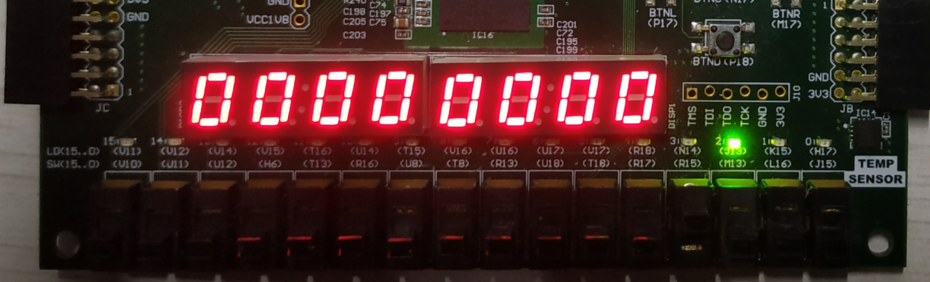

 上图只有LED[2]亮，这是系统刚通电，存储子系统未就绪。

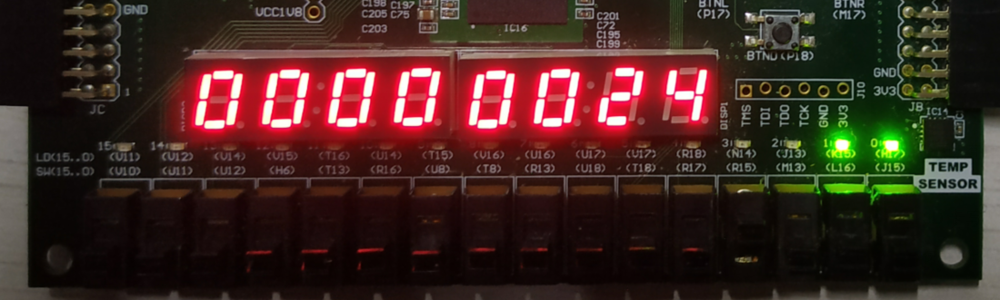

 上图LED[0]、LED[1]亮，表示系统就绪并且从存储子系统中读出了数据。

### 4.2. SD卡写入程序测试

 使用

[winhex]: http://www.x-ways.net/winhex/

软件，从SD卡0地址开始写入应用程序。

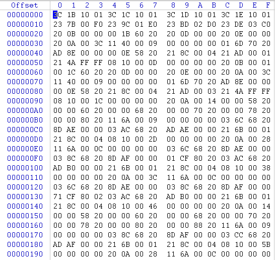

 上面写的时系统结构静态流水线CPU的测试程序。

 下板执行：

 **C[12]**

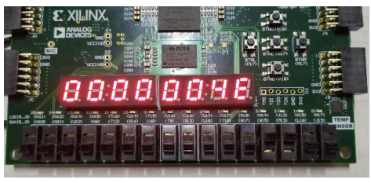

 **C[24]**

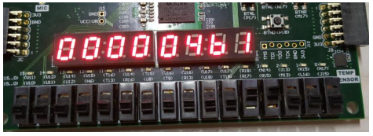

 **D[18]**

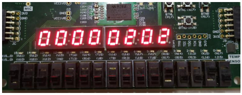

 **D[26]**

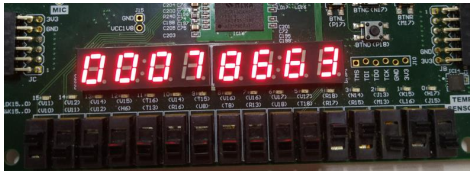

 下板拨动开关遍历数组，逐一和 Mars 的结果对比，结果一致，说明流水线工作正常。

### 4.3. 中途更换SD卡测试

 不重新下板，更换写着另一个程序的SD卡，按下reset键，板子将跑新的程序。

 这里我换上的是《计算机组成原理》课程用于验证CPU功能的测试程序。

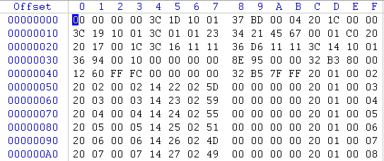

 下板结果：


 下板结果为1~F依次从右边流出，循环往复，符和预期结果，中途替换SD卡成功。

## 5. 总结

 本次实验是我用Vivado以来，写过最难的一个项目。难点不仅在于模块众多、时序复杂、仿真困难，还在于需要查阅大量的资料来实现SD卡和DDR的使用。

 万丈高楼，平地升起。做数字系统设计也是如此，我的基本思路是，先做一个整体设计，将大系统划分为子系统，然后逐个模块击破，最后将他们连接起来。具体来说，CPU是之前完成的，那么首先要完成本次实验要用到的存储部件，包括DDR SDRAM、SD卡的读写。接着，要根据《计算机系统结构》课程所学的三级存储的知识，设计合适的地址划分、Cache映射和替换方案，然后写一个三级存储总控制器来控制三级部件的协作。

 这次提升实验，我最大的收获，莫过于看了无数的波形，让我深刻体会到下板不如看波形，许多BUG都是我在看波形的时候解决的。这也极大的锻炼了我设计仿真、观察信号和系统工作过程的能力。所谓提升实验，不仅是难度的提升，也是对能力的提升。

## 6. 源代码与说明

 整个Vivado项目中，模块的层次如下图所示。

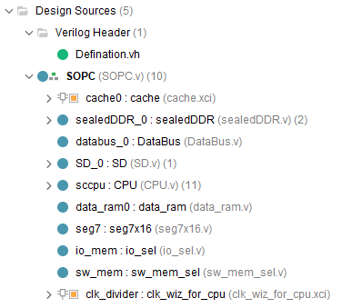

 由于文件过多，这里不在报告中贴出。详细代码请见附件。下面给出源程序文件的说明。

 源程序文件可以分为以下三类（仅列出模块文件，未列出仿真文件、波形格式文件、管脚约束文件等）

-  **第一类：三级存储子系统模块**

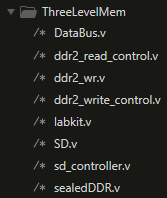

| 文件名              | 说明             |
| ------------------- | ---------------- |
| DataBus.v           | 三级存储总控制器 |
| ddr_read_control.v  | DDR读控制模块    |
| ddr_wr.v            | DDR控制器        |
| ddr_write_control.v | DDR写控制模块    |
| labkit.v            | SD用户控制模块   |
| SD                  | SD封装           |
| sd_controller.v     | SD物理信号控制器 |
| sealedDDR.v         | DDR封装          |

-  **第二类：动态流水线****CPU****模块**

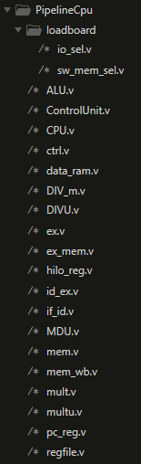

| 文件名        | 说明                |
| ------------- | ------------------- |
| io_sel.v      | 外设编址器          |
| sw_mem_sel.v  | 开关编址信号控制    |
| ALU.v         | 算术逻辑运算单元    |
| ControlUnit.v | 译码段              |
| CPU.v         | CPU封装             |
| ctrl.v        | 流水暂停控制器      |
| data_ram.v    | 数据RAM             |
| DIV_m.v       | 有符号除法器        |
| DIVU.v        | 无符号除法器        |
| ex.v          | 执行段              |
| ex_mem.v      | 执行-访存流水寄存器 |
| hilo_reg.v    | hilo寄存器          |
| id_ex.v       | 译码-执行流水寄存器 |
| if_id.v       | 取址-译码流水寄存器 |
| MDU.v         | 乘除法单元          |
| mem.v         | 访存段              |
| mem_wb.v      | 访存-写回流水寄存器 |
| mult.v        | 有符号乘法器        |
| multu.v       | 无符号乘法器        |
| pc_reg.v      | PC寄存器            |
| regfile.v     | 通用寄存器堆        |

-  **第三类：顶层模块**

| 文件名        | 说明                 |
| ------------- | -------------------- |
| Defination.vh | 宏定义文件           |
| seg7x16.v     | 七段数码管控制器     |
| SOPC.v        | 系统整体封装顶层文件 |

